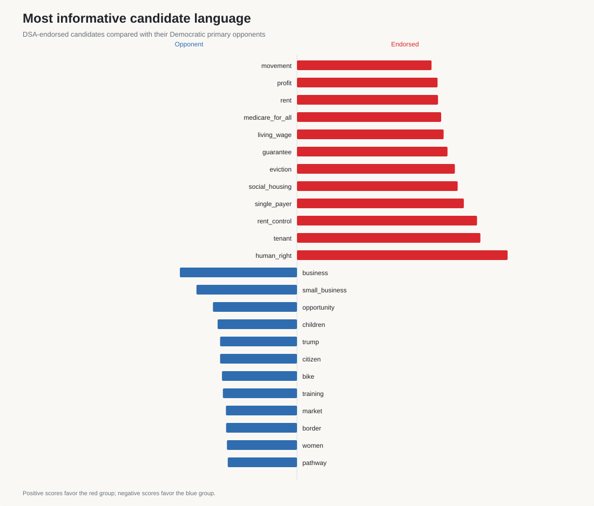
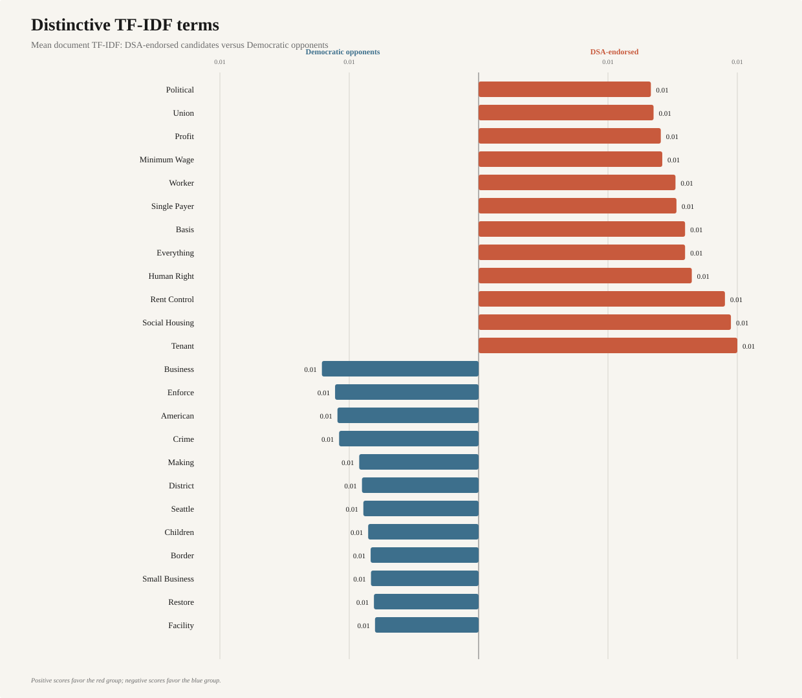
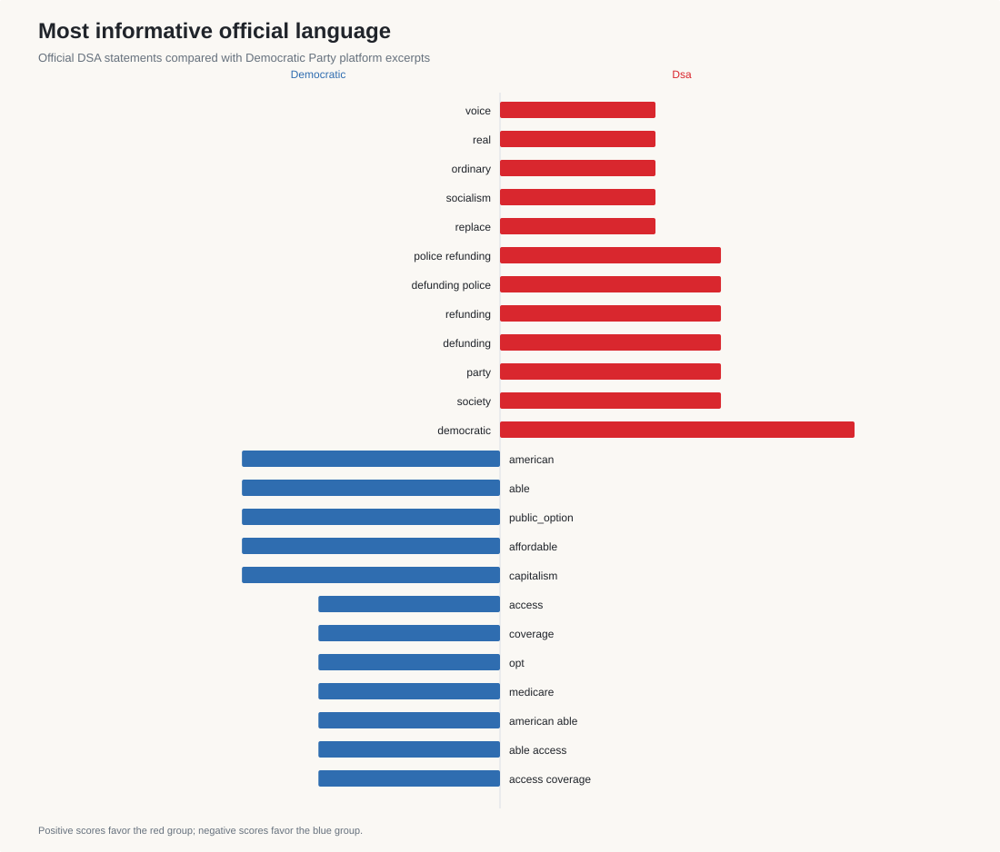
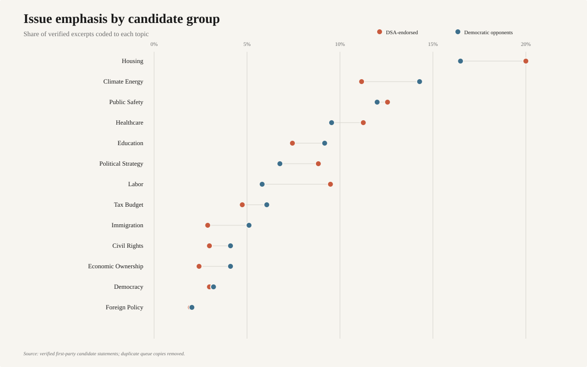
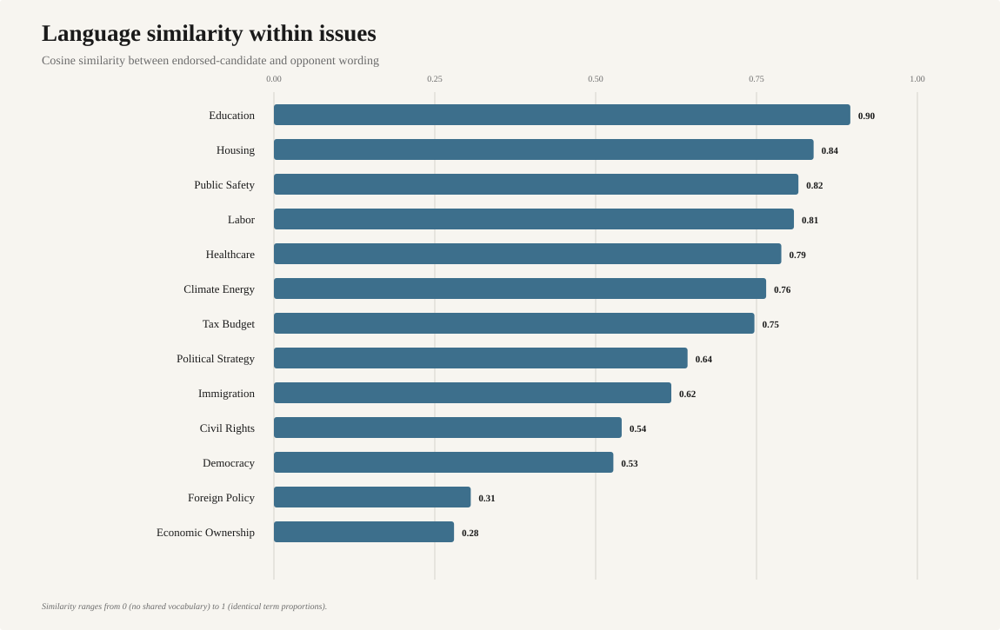
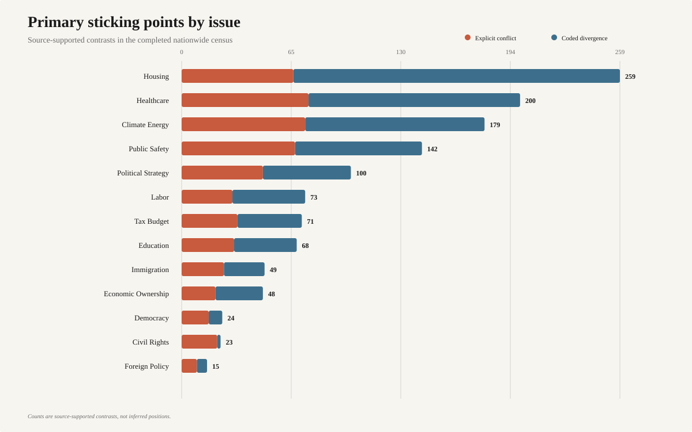
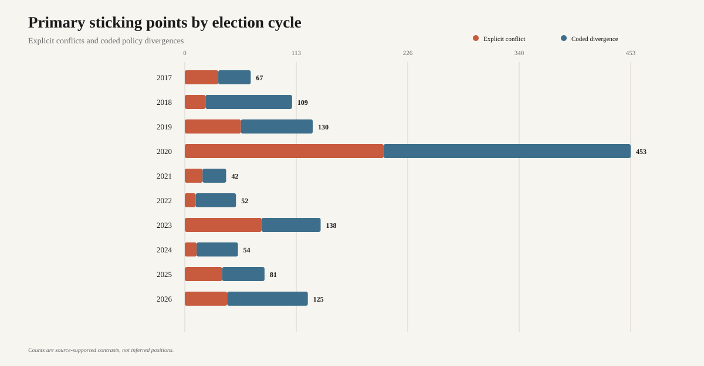

# Democratic Socialists of America (DSA) positions and Democratic Party Positions Contrast

This project is a source-first study of what the Democratic Socialists of America, the
Democratic Party, and candidates in Democratic primaries have said since 2016.

It builds an auditable national dataset of DSA endorsements, identifies the other candidates in
those primaries, collects exact passages from first-party sources, and analyzes where their
positions align or diverge. The resulting data supports a report on the policy and strategic
differences between DSA, Democratic Party platforms, DSA-endorsed candidates, and their primary
opponents.

## What the project does

- Collects current and historical endorsements from DSA National and local chapters.
- Tracks which chapter-year records have been searched so gaps are explicit rather than silently
  treated as no endorsements.
- Reconstructs Democratic primary ballot rosters for endorsed candidates.
- Collects exact candidate and opponent statements from official pages, documents, interviews,
  debates, and archived sources.
- Compares DSA and Democratic Party texts within the election cycle in which they were published.
- Separates direct, explicit conflicts from analyst-coded policy divergences.
- Validates provenance, source status, review state, and coding before generating tables and a
  draft report.

## Evidence standard

Substantive findings must be supported by exact quotations from official organizational or
campaign sources. Journalism, search results, and third-party trackers can help locate evidence,
but they do not substantiate a claim on their own.

Automated tools may retrieve pages, discover leads, and suggest structured data. A human reviewer
must verify every excerpt used in the report against the original page, PDF, audio, or video.
Missing evidence is recorded with statuses such as `not_searched`, `searched_not_found`,
`source_unavailable`, and `found_unverified`; absence of a statement is not interpreted as a
position.

## Outputs

- `data/manual/` contains reviewed source metadata, excerpts, endorsements, race rosters, and
  coded contrasts.
- `data/processed/` contains collection results, research queues, coverage ledgers, verified
  endorsements, and the SQLite research database.
- `outputs/tables/` contains generated analysis tables.
- `outputs/figures/text_analysis/` contains reproducible SVG text-analysis graphs.
- `outputs/tables/text_analysis/` contains TF-IDF, MPIF, similarity, topic, cycle, and manifest
  tables used by those figures.
- `report/draft.md` contains the generated research report and current dataset status.
- `report/text_analysis.md` explains the graph methods and summarizes the principal lexical
  findings.

## Repository guide

- `src/dsa_analysis/` — collection, crawling, adjudication, validation, and analysis code
- `config/` — source registry and policy taxonomy
- `docs/methodology.md` — research design and source hierarchy
- `docs/codebook.md` — coding rules
- `docs/data_dictionary.md` — dataset fields
- `docs/completeness.md` — coverage and completion criteria
- `tests/` — validation and analysis tests

## Running the project

The project requires Python 3.12 and uses `uv` for its development environment. The main entry
point is `dsa-analysis`; run `uv run dsa-analysis --help` to see the collection and research
commands.

To rebuild the reviewed data and report:

```bash
uv run dsa-analysis init-db
uv run dsa-analysis validate
uv run dsa-analysis analyze
uv run dsa-analysis analyze-text
```

`analyze-text` uses only the Python standard library. It compares:

- reviewed official DSA excerpts with reviewed Democratic Party platform excerpts; and
- verified statements by DSA-endorsed candidates with verified statements by their Democratic
  primary opponents.

It generates mean TF-IDF, weighted log-odds most-informative-feature (MPIF) scores, topic shares,
within-topic cosine similarity, and sticking-point counts by topic and cycle. Identical candidate
quotes repeated through multiple endorsement queues are deduplicated by candidate and election.
The generated `analysis_manifest.json` records input hashes and method parameters.

## Text-analysis graph gallery

The figures use one consistent publication palette throughout: DSA red for endorsed/DSA text,
Democratic blue for opponent/DNC text, charcoal labels, and a warm neutral background.

### Distinctive candidate language





### Official DSA and Democratic Party language



### Issue emphasis and similarity





### Primary sticking points





Run the test suite with:

```bash
uv run python -m unittest discover -s tests
```
