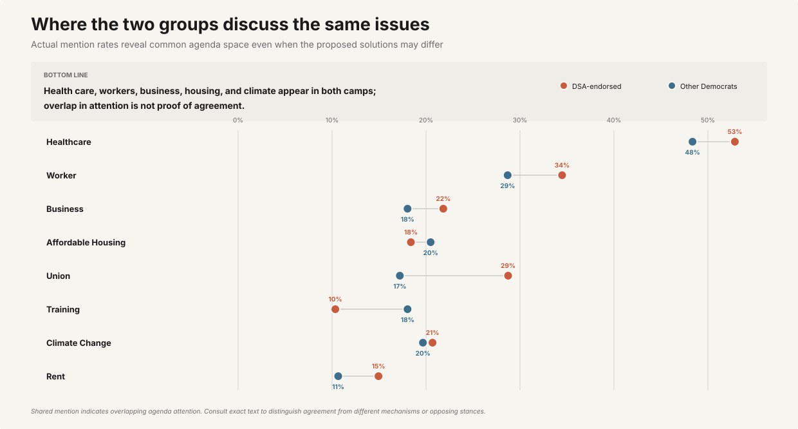
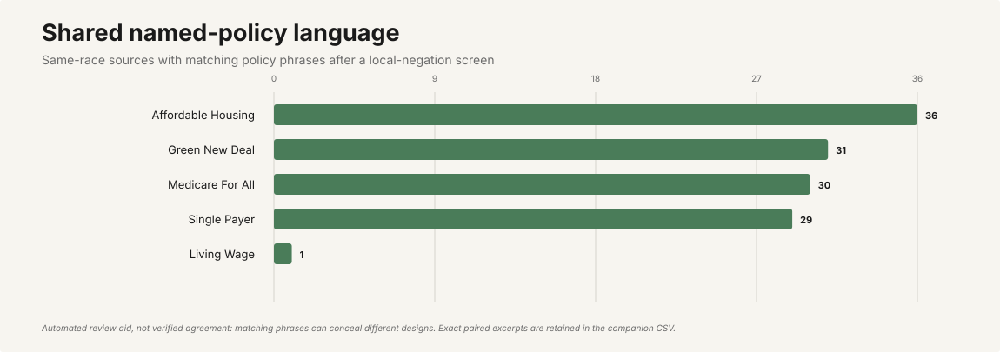
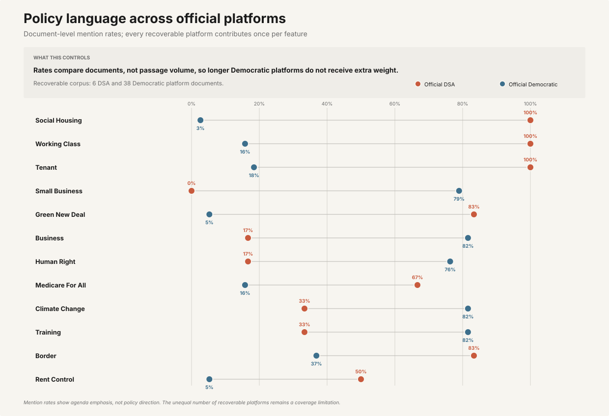
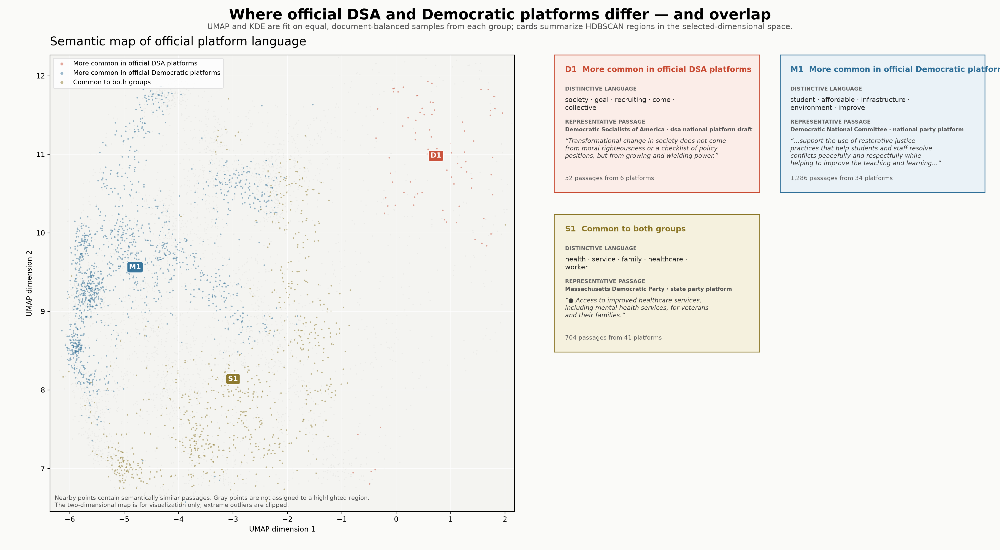

# DSA and Democratic primary positions

**Research window:** 2016-01-01 through 2026-08-12

## Scope and canonical outputs

This report is generated from the current race registry, full-text audit, organizational-context
inventory/extraction summaries, endorsement-census outputs, and full-corpus analysis manifests.
The small reviewed quotations below are qualitative examples only; their counts are not corpus
totals and are not used as the denominator for the quantitative sections.

## 1. Denominator completeness

- Canonical races: 578
- In-scope DSA-endorsed Democratic primaries: 421
- In-scope races with unresolved denominator metadata: 72
- In-scope candidate/race records represented in the registry: 1912
- Valid official-election-source rows: 404
- National candidate endorsements: 308
- National endorsements matched to in-scope races: 148
- National endorsements absent from the registry:
  7

These are denominator and reconciliation counts, not claims that every candidate has usable text.
The race denominator remains incomplete while unresolved in-scope races or unmatched national
endorsements remain.

## 2. National and local endorsement census

The official national archive contains **357 campaign records**.
Its cycle distribution is:

- Endorsed 2016: 1
- Endorsed 2017: 6
- Endorsed 2018: 21
- Endorsed 2019: 23
- Endorsed 2020: 48
- Endorsed 2021: 55
- Endorsed 2022: 50
- Endorsed 2023: 59
- Endorsed 2024: 43
- Endorsed 2025: 21
- Endorsed 2026: 30

- Verified local candidate endorsements: 349
- Local chapter-year search units: 2673
- Local chapter-year units still `not_searched` or `found_unverified`:
  1612

The local verified file is a census output, but unresolved chapter-year search units remain
explicit coverage gaps. Verified endorsement counts must not be substituted for a complete
nationwide local denominator.

## 3. Candidate-document coverage

- Registry candidate/race records in the document queue: 1927
- Records with verified extraction status: 1032
- Retryable candidate-document gaps: 891
- Candidates with substantive extracted text: 942
- Substantive source documents: 1585
- Eligible analysis segments before analysis-specific deduplication:
  39310
- Clean document-backed races: 392
- Two-sided paired races eligible for comparison: 268

Candidate-document coverage is incomplete. Shared multi-candidate documents without usable
locators remain provenance-only and are excluded from analysis eligibility.

## 4. Official-platform coverage

- Represented state-cycle rows: 180
- Inventory rows across DNC, DSA, state-party, and local-DSA categories:
  730
- Verified organizational-context inventory rows: 424
- Platform-gap rows: 154
- Fetched organizational documents: 93
- Successfully extracted organizational documents: 93
- Extraction errors: 0
- Eligible full-platform documents in lexical analysis: 44
- Analyzed DSA platforms: 6
- Analyzed Democratic platforms: 38
- Eligible full-platform source segments: 5662

Every represented state-cycle has an explicit status for each context category, but explicit
`searched_not_found`, `source_unavailable`, and `not_applicable` statuses are not extracted
platform text. Official-platform lexical results therefore describe the recoverable full-platform
subset.

## 5. Full-corpus lexical and topic outputs

- Candidate source documents used by lexical analysis: 1592
- Candidate source segments before shared-text deduplication: 39310
- Candidate segments after deduplication: 38207
- Candidate analysis documents after deduplication: 1341
- Unique source-supported primary contrasts: 1251
- Local-model classified segments: 25614
- Local-model unclassified segments below threshold: 12593

TF-IDF, MPIF, document prevalence, source mix, cycle volume, explicit-conflict, and local-model
topic outputs are generated from the full eligible segment snapshots, not from the legacy manual
excerpt table.

## 6. Provisional KDE

- Status: **provisional**
- Retained segments: 36613
- Candidates represented: 242 endorsed and
  464 other Democrats
- Selected UMAP dimensions: 10
- Density-fit sample: 5000 endorsed and
  5000 other-Democrat segments

The KDE remains provisional because the full-text sufficiency audit fails. It describes the
currently recoverable segmented corpus and is not a complete-census estimate. The labeled
regions are derived from the underlying segments in each locally overrepresented or shared
high-density area; each label reports distinctive terms, an extractive representative passage,
and candidate support.

## 7. Official-platform KDE

- DSA documents: 6
- Democratic documents: 38
- Selected UMAP dimensions: 5
- UMAP/KDE fit sample: 328 passages per group, sampled
  round-robin across documents

Equal-size, document-balanced fitting prevents the larger Democratic passage inventory from
mechanically determining the semantic manifold or density estimates. It does not compensate for
missing platforms or make the smaller DSA document inventory substantively equivalent. HDBSCAN
regions report distinctive terms and exact representative passages for DSA-overrepresented,
Democratic-overrepresented, and shared high-density areas.

## 8. Small reviewed qualitative examples

These quotations and hand-coded contrasts are intentionally a small, nonrepresentative
qualitative layer. They illustrate what exact source-level evidence looks like; they are not
frequency estimates and their row counts are not corpus totals.

- **economic_ownership/worker_control:** "We must replace it with democratic socialism, a system where ordinary people have a real voice in our workplaces, neighborhoods, and society." — DSA, [What is Democratic Socialism?](https://www.dsausa.org/about-us/what-is-democratic-socialism/), Paragraph 1
- **economic_ownership/public_ownership:** "We want to collectively own the key economic drivers that dominate our lives, such as energy production and transportation." — DSA, [What is Democratic Socialism?](https://www.dsausa.org/about-us/what-is-democratic-socialism/), Paragraph 3
- **political_strategy/movement_building:** "The Democratic Socialists of America is building a party whose goal is a democratic society of the working class." — DSA, [DSA National Program](https://program.dsausa.org/), Paragraph 4

### Reviewed DSA-Democratic platform examples

### Healthcare (2020)

- **DSA:** "single-payer Medicare for All, defunding the police/refunding communities, the Green New Deal"
- **Democratic platform:** "To achieve that objective, we will give all Americans the choice to select a high-quality, affordable public option through the Affordable Care Act marketplace."
- **Coded relationship:** `different_mechanism` — DSA names single-payer while the DNC platform selects an ACA public option
### Immigration (2020)

- **DSA:** "abolition of the agencies of Immigration and Customs Enforcement and Customs and Border Protection"
- **Democratic platform:** "Immigration and Customs Enforcement and Customs and Border Protection personnel abide by our values and professional, evidence-based standards and are held accountable for any inappropriate, unlawful, or inhumane treatment."
- **Coded relationship:** `explicit_disagreement` — DSA calls for abolition while the DNC platform retains the agencies with oversight
### Public Safety (2024)

- **DSA:** "defunding the police/refunding communities"
- **Democratic platform:** "We need to fund the police, not defund the police."
- **Coded relationship:** `explicit_disagreement` — The texts use directly opposing fund and defund language
### Economic Ownership (2024)

- **DSA:** "We want to collectively own the key economic drivers that dominate our lives, such as energy production and transportation."
- **Democratic platform:** "capitalism without competition isn't capitalism, it's exploitation."
- **Coded relationship:** `explicit_disagreement` — DSA calls for collective ownership of key sectors while the DNC text affirms regulated competitive capitalism

### Reviewed primary sticking-point example

### mo01-dem-primary-2026: Foreign Policy

- **Cori Bush:** "As stated by Human Rights Watch and Amnesty International, a genocide is happening in Gaza. Now, funding for other things that they may need, I have no problem with that. But to harm other people for weapons, absolutely."
- **Wesley Bell:** "I am no fan of [Israeli Prime Minister] Bibi Netanyahu, but we're still going to stand with our allies. And when we disagree, there's going to be disagreements. And I've been able to say to his face that I disagree with him. But it's important that we stand with our allies in Ukraine, Israel, Taiwan, Western Europe."
- **Coded relationship:** `explicit_disagreement` — Bush supported cutting off military weapons aid while Bell supported continuing to stand with Israel as an ally
- **Shared source:** [Bell and Bush joint appearance](https://www.stlpr.org/show/st-louis-on-the-air/2026-07-24/missouri-wesley-bell-cori-bush-radio-appearance)

## Remaining gaps

- The race registry has 72 unresolved in-scope races and
  7 national endorsements absent from the
  registry.
- Candidate-document recovery has 891 retryable candidate gaps;
  the full-text sufficiency decision is **insufficient**.
- Local census coverage has 1612 unresolved chapter-year units.
- Organizational context has 154 platform-gap rows and
  0 extraction error.
- Source-class and group/year imbalance diagnostics still prevent population-level frequency
  claims.

## Audit warnings

- 19 other-Democrat records still need verified first-party evidence

Generated 2026-08-26. See `docs/methodology.md` for evidence rules.
