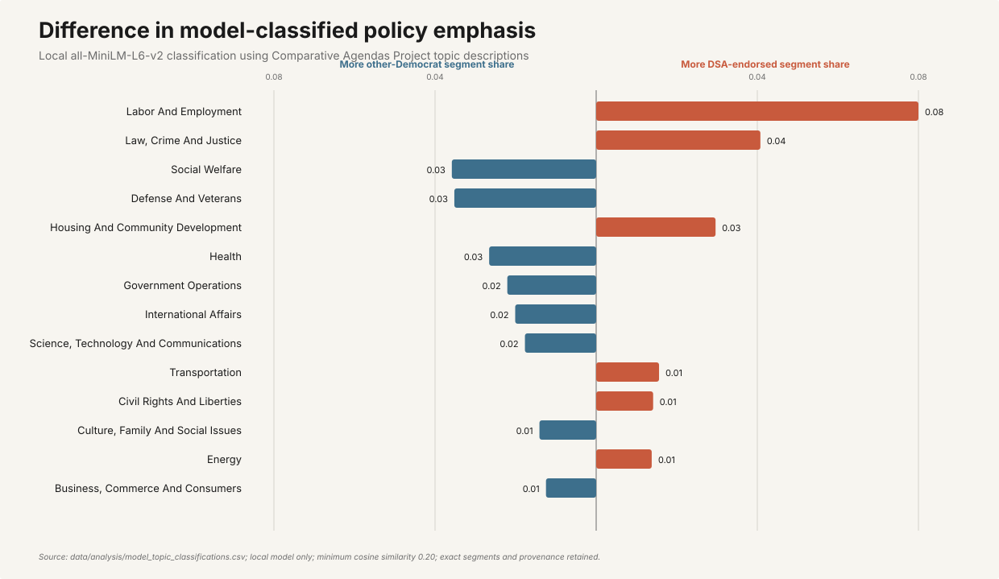

# DSA and Democratic primary positions

**Research window:** 2016-01-01 through 2026-08-12

## Current dataset status

- Registered documents: 15
- Verified documents: 12
- Verified DSA endorsements: 4
- Tracked Democratic primaries: 3
- Candidates on tracked primary ballots: 23
- Opponents requiring comparison: 20
- Opponents with verified first-party evidence: 1
- Reviewed exact excerpts: 14
- Reviewed party-platform comparisons: 4
- Candidate/opponent contrasts: 1
- Chapter-year coverage records: 0

## Official national endorsement census

The official DSA National archive currently yields **357 unique
campaign records**. Removing rows categorized only as ballot initiatives leaves
**328 candidate or office records** requiring verification of party,
primary type, opponents, and campaign sources. The current chapter directory creates
**2640 chapter-year search units** for 2016–2026.

- Endorsed 2016: 1
- Endorsed 2017: 6
- Endorsed 2018: 21
- Endorsed 2019: 23
- Endorsed 2020: 48
- Endorsed 2021: 55
- Endorsed 2022: 50
- Endorsed 2023: 59
- Endorsed 2024: 43
- Endorsed 2025: 21
- Endorsed 2026: 30

These counts cover national endorsements. The manually verified layer separately includes local
endorsements such as Zohran Mamdani by NYC-DSA and Francesca Hong by Madison Area DSA and
Milwaukee DSA. Together, the national archive and verified local layer form the completed nationwide endorsement census under the methodology's source-availability rules.

## Nationwide local-chapter census status

- Current chapters and organizing committees crawled: 240
- Endorsement-like first-party pages discovered: 1927
- Reviewable endorsement mentions extracted: 4619
- High-confidence candidate/office leads extracted: 100
- Independently verified local candidate endorsements: 938
- Rejected candidate-level false positives: 24
- Chapter-year coverage units: 2640
- Unresolved chapter-year units: 0
- National and local endorsed candidacies queued: 1254
- Endorsed candidacies with resolved roster research: 1254
- Candidate rows in verified primary rosters: 3518
- Exact candidate evidence rows: 7350
- Derived primary sticking-point rows: 1388

Strict validation passes: every chapter-year is resolved and every endorsed candidacy has a resolved race, roster, and candidate/opponent evidence status.

## Findings from reviewed first-party text

The reviewed DSA material explicitly describes democratic socialism in terms of replacing
capitalism, expanding democratic control into workplaces and the economy, and collective or
public ownership of key economic systems. It also describes electoral work as movement-building
rather than simple alignment with the Democratic Party. These are direct textual observations,
not claims about every endorsed candidate.

- **economic_ownership/worker_control:** "We must replace it with democratic socialism, a system where ordinary people have a real voice in our workplaces, neighborhoods, and society." — DSA, [What is Democratic Socialism?](https://www.dsausa.org/about-us/what-is-democratic-socialism/), Paragraph 1
- **economic_ownership/public_ownership:** "We want to collectively own the key economic drivers that dominate our lives, such as energy production and transportation." — DSA, [What is Democratic Socialism?](https://www.dsausa.org/about-us/what-is-democratic-socialism/), Paragraph 3
- **political_strategy/movement_building:** "The Democratic Socialists of America is building a party whose goal is a democratic society of the working class." — DSA, [DSA National Program](https://program.dsausa.org/), Paragraph 4
- **political_strategy/democratic_party:** "If Bernie Sanders doesn't get the Democratic nomination, DSA won't endorse another Democratic Party presidential candidate." — DSA, [2019 Convention Highlights](https://www.dsausa.org/2019-convention-a-world-to-win/), BERNIE section
- **healthcare/single_payer:** "single-payer Medicare for All, defunding the police/refunding communities, the Green New Deal" — DSA, [What is Democratic Socialism?](https://www.dsausa.org/about-us/what-is-democratic-socialism/), Paragraph 3
- **public_safety/police_abolition:** "defunding the police/refunding communities" — DSA, [What is Democratic Socialism?](https://www.dsausa.org/about-us/what-is-democratic-socialism/), Paragraph 3
- **immigration/abolish_ice:** "abolition of the agencies of Immigration and Customs Enforcement and Customs and Border Protection" — DSA, [2019 Convention Highlights](https://www.dsausa.org/2019-convention-a-world-to-win/), OPEN BORDERS section
- **healthcare/public_option:** "Americans should be able to access public coverage through a public option, and those over 55 should be able to opt in to Medicare." — Democratic National Committee, [2016 Democratic Party Platform](https://democrats.org/wp-content/uploads/sites/2/2019/07/2016_DNC_Platform.pdf), PDF page 36
- **healthcare/public_option:** "To achieve that objective, we will give all Americans the choice to select a high-quality, affordable public option through the Affordable Care Act marketplace." — Democratic National Committee, [2020 Democratic Party Platform](https://democrats.org/wp-content/uploads/sites/2/2020/08/2020-Democratic-Party-Platform.pdf), PDF page 29
- **immigration/border_policy:** "Immigration and Customs Enforcement and Customs and Border Protection personnel abide by our values and professional, evidence-based standards and are held accountable for any inappropriate, unlawful, or inhumane treatment." — Democratic National Committee, [2020 Democratic Party Platform](https://democrats.org/wp-content/uploads/sites/2/2020/08/2020-Democratic-Party-Platform.pdf), PDF page 65
- **economic_ownership/regulation:** "capitalism without competition isn't capitalism, it's exploitation." — Democratic National Committee, [2024 Democratic Party Platform](https://democrats.org/wp-content/uploads/2025/07/2024-Democratic-Party-Platform.pdf), PDF page 24
- **public_safety/police_abolition:** "We need to fund the police, not defund the police." — Democratic National Committee, [2024 Democratic Party Platform](https://democrats.org/wp-content/uploads/2025/07/2024-Democratic-Party-Platform.pdf), PDF page 41
- **foreign_policy/palestine:** "As stated by Human Rights Watch and Amnesty International, a genocide is happening in Gaza. Now, funding for other things that they may need, I have no problem with that. But to harm other people for weapons, absolutely." — Cori Bush, [Bell and Bush joint appearance](https://www.stlpr.org/show/st-louis-on-the-air/2026-07-24/missouri-wesley-bell-cori-bush-radio-appearance), Israel and military aid exchange
- **foreign_policy/palestine:** "I am no fan of [Israeli Prime Minister] Bibi Netanyahu, but we're still going to stand with our allies. And when we disagree, there's going to be disagreements. And I've been able to say to his face that I disagree with him. But it's important that we stand with our allies in Ukraine, Israel, Taiwan, Western Europe." — Wesley Bell, [Bell and Bush joint appearance](https://www.stlpr.org/show/st-louis-on-the-air/2026-07-24/missouri-wesley-bell-cori-bush-radio-appearance), Israel and military aid exchange

## Reviewed DSA-Democratic platform contrasts

### Healthcare (2020)

- **DSA:** "single-payer Medicare for All, defunding the police/refunding communities, the Green New Deal"
- **Democratic platform:** "To achieve that objective, we will give all Americans the choice to select a high-quality, affordable public option through the Affordable Care Act marketplace."
- **Coded relationship:** `different_mechanism` — DSA names single-payer while the DNC platform selects an ACA public option
### Immigration (2020)

- **DSA:** "abolition of the agencies of Immigration and Customs Enforcement and Customs and Border Protection"
- **Democratic platform:** "Immigration and Customs Enforcement and Customs and Border Protection personnel abide by our values and professional, evidence-based standards and are held accountable for any inappropriate, unlawful, or inhumane treatment."
- **Coded relationship:** `explicit_disagreement` — DSA calls for abolition while the DNC platform retains the agencies with oversight
### Public Safety (2024)

- **DSA:** "defunding the police/refunding communities"
- **Democratic platform:** "We need to fund the police, not defund the police."
- **Coded relationship:** `explicit_disagreement` — The texts use directly opposing fund and defund language
### Economic Ownership (2024)

- **DSA:** "We want to collectively own the key economic drivers that dominate our lives, such as energy production and transportation."
- **Democratic platform:** "capitalism without competition isn't capitalism, it's exploitation."
- **Coded relationship:** `explicit_disagreement` — DSA calls for collective ownership of key sectors while the DNC text affirms regulated competitive capitalism

## Reviewed primary sticking-point example

### mo01-dem-primary-2026: Foreign Policy

- **Cori Bush:** "As stated by Human Rights Watch and Amnesty International, a genocide is happening in Gaza. Now, funding for other things that they may need, I have no problem with that. But to harm other people for weapons, absolutely."
- **Wesley Bell:** "I am no fan of [Israeli Prime Minister] Bibi Netanyahu, but we're still going to stand with our allies. And when we disagree, there's going to be disagreements. And I've been able to say to his face that I disagree with him. But it's important that we stand with our allies in Ukraine, Israel, Taiwan, Western Europe."
- **Coded relationship:** `explicit_disagreement` — Bush supported cutting off military weapons aid while Bell supported continuing to stand with Israel as an ally
- **Shared source:** [Bell and Bush joint appearance](https://www.stlpr.org/show/st-louis-on-the-air/2026-07-24/missouri-wesley-bell-cori-bush-radio-appearance)

## Primary sticking-point counts

These are nationwide counts of recorded, source-supported contrasts in the completed census. They measure expressed and recoverable campaign differences, not unspoken positions or voter priorities.

- Housing: 275
- Healthcare: 246
- Climate Energy: 193
- Public Safety: 154
- Political Strategy: 116
- Labor: 78
- Tax Budget: 74
- Education: 69
- Immigration: 62
- Economic Ownership: 53
- Civil Rights: 27
- Democracy: 26
- Foreign Policy: 15

## Reproducible text-analysis figures

The full TF-IDF, MPIF, topic-share, similarity, and cycle analysis is generated with
`uv run dsa-analysis analyze-text`.

## Limitations

The census is complete under the stated protocol, but source-unavailable records remain explicit unknowns. A missing quotation does not imply that a candidate held no position. Topic counts measure recoverable statements and coded contrasts, not the prevalence or intensity of beliefs among all candidates or voters. The platform matrix is limited to the reviewed official documents and election cycles.

## Audit warnings

- candidate_statement_evidence.csv:1436: unusually short quote
- candidate_statement_evidence.csv:1437: unusually short quote
- candidate_statement_evidence.csv:1647: unusually short quote
- candidate_statement_evidence.csv:1695: unusually short quote
- candidate_statement_evidence.csv:1707: unusually short quote
- candidate_statement_evidence.csv:2285: unusually short quote
- candidate_statement_evidence.csv:2286: unusually short quote
- candidate_statement_evidence.csv:2642: unusually short quote
- candidate_statement_evidence.csv:2643: unusually short quote
- candidate_statement_evidence.csv:2673: unusually short quote
- candidate_statement_evidence.csv:3668: unusually short quote
- candidate_statement_evidence.csv:3669: unusually short quote
- candidate_statement_evidence.csv:3670: unusually short quote
- candidate_statement_evidence.csv:3671: unusually short quote
- candidate_statement_evidence.csv:3672: unusually short quote
- candidate_statement_evidence.csv:3673: unusually short quote
- candidate_statement_evidence.csv:4005: unusually short quote
- candidate_statement_evidence.csv:4006: unusually short quote
- candidate_statement_evidence.csv:4264: unusually short quote
- candidate_statement_evidence.csv:4265: unusually short quote
- candidate_statement_evidence.csv:4266: unusually short quote
- candidate_statement_evidence.csv:4340: unusually short quote
- candidate_statement_evidence.csv:4638: unusually short quote
- candidate_statement_evidence.csv:4799: unusually short quote
- candidate_statement_evidence.csv:4800: unusually short quote
- candidate_statement_evidence.csv:4803: unusually short quote
- candidate_statement_evidence.csv:5002: unusually short quote
- candidate_statement_evidence.csv:5003: unusually short quote
- candidate_statement_evidence.csv:5004: unusually short quote
- candidate_statement_evidence.csv:6106: unusually short quote
- candidate_statement_evidence.csv:6107: unusually short quote
- candidate_statement_evidence.csv:6485: unusually short quote
- candidate_statement_evidence.csv:6486: unusually short quote
- candidate_statement_evidence.csv:7038: unusually short quote
- candidate_statement_evidence.csv:7142: unusually short quote
- candidate_statement_evidence.csv:7155: unusually short quote
- candidate_statement_evidence.csv:7156: unusually short quote
- candidate_statement_evidence.csv:7157: unusually short quote

Generated 2026-08-14. See `docs/methodology.md` for evidence rules.
