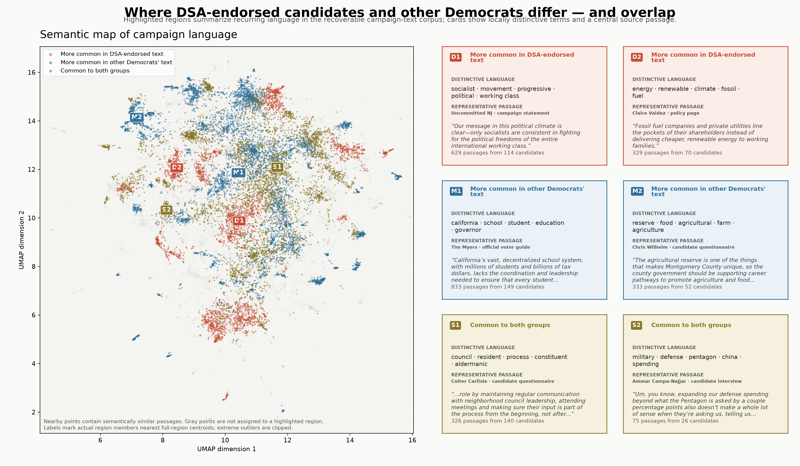

# Provisional GTE KDE region analysis

The KDE contains **36206** passages after deduplicating repeated text
within each candidate and election year:
**12106** from DSA-endorsed candidates and
**24100** from other Democrats. Density estimation is performed in
**10 dimensions**; the two-dimensional map is used only for
visualization.

## Interpreting the labeled regions

- **D regions** are spatial groupings among DSA-endorsed segments above the endorsed-group
  upper-quartile density-ratio cutoff.
- **M regions** are semantically coherent groupings among other-Democrat passages below that
  group's lower-quartile density-ratio cutoff.
- **S regions** are high-joint-density areas with small absolute density differences. They
  represent semantic overlap, not proof of identical positions.
- HDBSCAN identifies variable-shape clusters in the selected 10-dimensional UMAP representation
  (`min_cluster_size=60`, `min_samples=10`, Euclidean metric, EOM selection). Noise points remain
  unassigned. The table retains up to six substantive, sufficiently supported regions per zone;
  the map displays the top two per category to remain legible.
- Terms are locally distinctive document-prevalence terms from the underlying subregion text.
  Examples are extractive source passages, not generated paraphrases.

| Region | Interpretation | On map | Passages | Candidates | HDBSCAN confidence | Distinctive terms | Representative source text |
| --- | --- | --- | ---: | ---: | ---: | --- | --- |
| D1 | DSA-overrepresented | Yes | 629 | 114 | 0.87 | socialist, movement, progressive, political, working class | Uncommitted NJ: Our message in this political climate is clear—only socialists are consistent in fighting for the political freedoms of the entire international working class. |
| D2 | DSA-overrepresented | Yes | 329 | 70 | 0.79 | energy, renewable, climate, fossil, fuel | Claire Valdez: Fossil fuel companies and private utilities line the pockets of their shareholders instead of delivering cheaper, renewable energy to working families. |
| D3 | DSA-overrepresented | No | 327 | 61 | 0.72 | prison, incarceration, bail, incarcerated, jail | Jaslin Kaur: ...for the organizers from RAPP (Release Aging People from Prisons) for their work to end mass incarceration and release people who make up almost 20% of the current incarcerated... |
| D4 | DSA-overrepresented | No | 343 | 83 | 0.66 | housing, tenant, landlord, rent, eviction | Claire Valdez: Second: Housing as a human right: For far too long, real estate has had a stranglehold on New Y ork City, and the result has been the violent eviction and displacement of our Black and... |
| D5 | DSA-overrepresented | No | 88 | 25 | 0.89 | israel, palestinian, military, israeli, palestine | Claire Valdez: Since 2018, Israel has received at least $3.8 billion in military funds annually which have been used to carry out atrocities against Palestinians and war against its neighbors. |
| D6 | DSA-overrepresented | No | 261 | 61 | 0.65 | worker, wage, union, minimum wage, child | Melat Kiros: That means: • Passing the PRO Act to make it easier for workers to organize, form unions, and collectively bargain • Ending at-will employment, strengthening wrongful termination... |
| M1 | Other-Democrat-overrepresented | Yes | 833 | 149 | 0.97 | california, school, student, education, governor | Tim Myers: California’s vast, decentralized school system, with millions of students and billions of tax dollars, lacks the coordination and leadership needed to ensure that every student, regardless... |
| M2 | Other-Democrat-overrepresented | Yes | 333 | 52 | 0.70 | reserve, food, agricultural, farm, agriculture | Chris Wilhelm: The agricultural reserve is one of the things that makes Montgomery County unique, so the county government should be supporting career pathways to promote agriculture and food service. |
| M3 | Other-Democrat-overrepresented | No | 480 | 145 | 0.94 | alderman, chicago, university, sun-time, editorial | Katie Sieracki: CLOSE Twitter Facebook Bluesky Email Reddit Flipboard The Sun-Times Editorial Board sent the candidates running for 33rd Ward alderman a list of questions to find out their views on a range... |
| M4 | Other-Democrat-overrepresented | No | 547 | 139 | 0.79 | housing, affordable housing, unit, affordable, zoning | Radwan Chowdhury: It will prioritize workforce and missing middle housing while ensuring deeply affordable units are included through strengthened inclusionary zoning. |
| M5 | Other-Democrat-overrepresented | No | 74 | 32 | 0.95 | composting, waste, recycling, incinerator, incineration | Hamza Khan: ...should be moving toward a long-term strategy centered on waste reduction, reuse, composting, recycling modernization, and circular economy principles rather than continued dependence... |
| M6 | Other-Democrat-overrepresented | No | 134 | 51 | 0.95 | oversight, performance, agency, accountability, council | Terry Lynch: Terry Lynch: The Council oversight of agency performance must be stronger as we are failing in delivery of basic services – the rats are winning, there is no pre-treating of streets before... |
| S1 | Shared high-density | Yes | 326 | 140 | 0.85 | council, resident, process, constituent, aldermanic | Colter Carlisle: ...role by maintaining regular communication with neighborhood council leadership, attending meetings and making sure their input is part of the process from the beginning, not after... |
| S2 | Shared high-density | Yes | 75 | 26 | 0.97 | military, defense, pentagon, china, spending | Ammar Campa-Najjar: Um, you know, expanding our defense spending beyond what the Pentagon is asked by a couple percentage points also doesn’t make a whole lot of sense when they’re asking us, telling us this... |
| S3 | Shared high-density | No | 263 | 78 | 0.75 | tax, revenue, pay, income, corporation | Ashley Hartmeier-Prigg: We must fully fund our schools and we can only do that with revenue system reform that gives tax relief to seniors and folks living on fixed incomes while demanding that corporations and... |
| S4 | Shared high-density | No | 161 | 51 | 0.97 | diego, union-tribune, onondaga, represent, legislature | Tammy M. Honeywell: Honeywell faces former Syracuse Common Council member Chad Ryan in the Democratic primary to represent the party in the race for the Onondaga County Legislature’s 8th District. |
| S5 | Shared high-density | No | 153 | 37 | 0.91 | attorney, case, travis, prosecutor, victim | Erin Martinson: As a prosecutor with the Travis County Attorney’s Office, I led the protective order division and transformed it into a statewide model for other offices. |
| S6 | Shared high-density | No | 95 | 31 | 0.93 | climate change, climate, global, emission, scientist | Ammar Campa-Najjar: ...struck a landmark deal in Paris to rein in greenhouse gas emissions in an effort to avert the worst effects of global warming, humanity is headed toward those very climate... |

## Limits

This is a descriptive analysis of the recoverable corpus. Region labels summarize the text
actually present in each density area; they do not imply a complete nationwide census, causal
importance, or agreement merely because both groups occupy a shared region.
