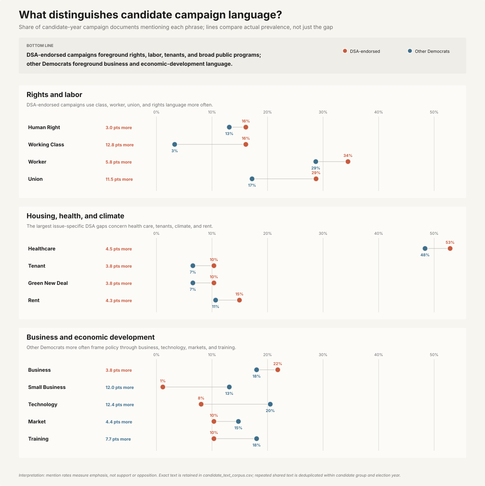
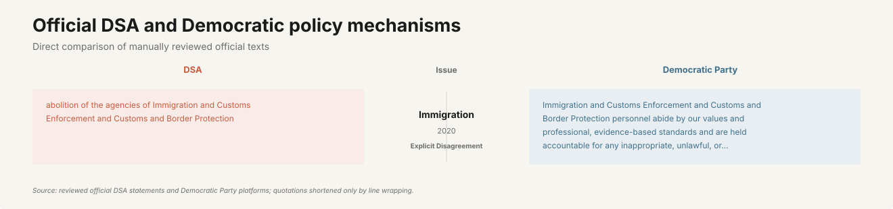
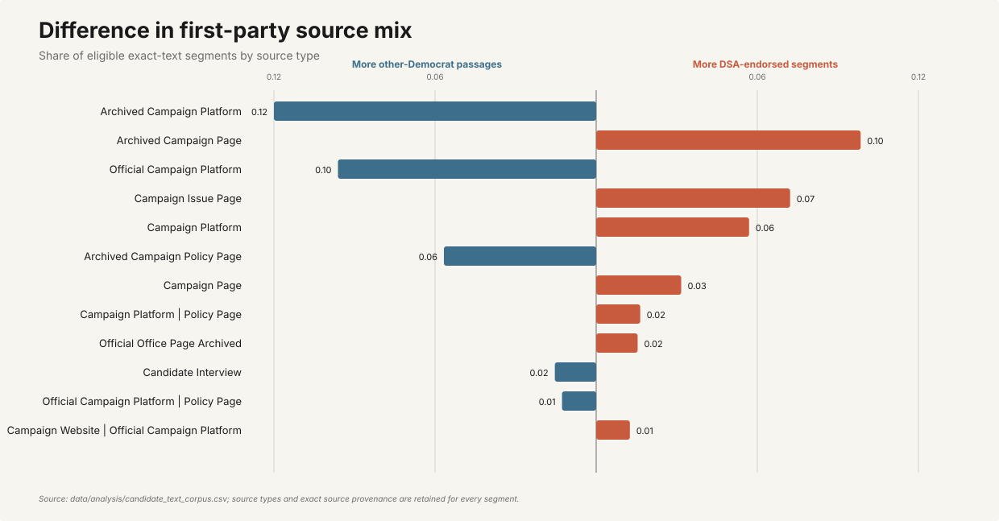
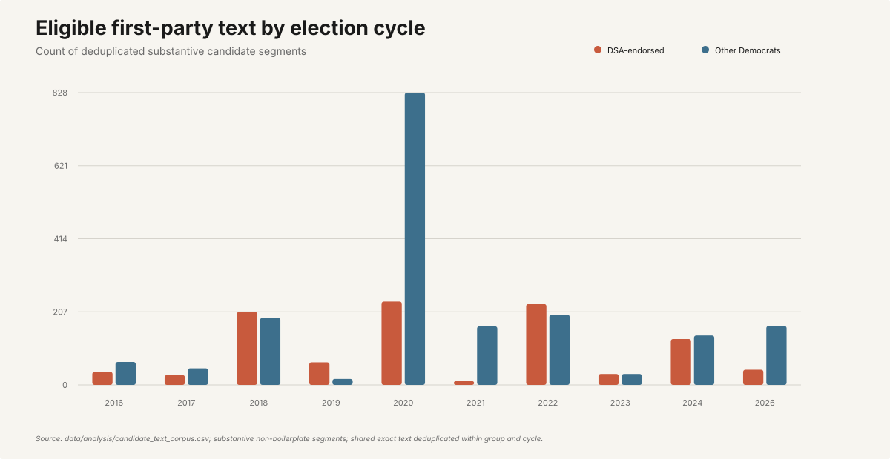
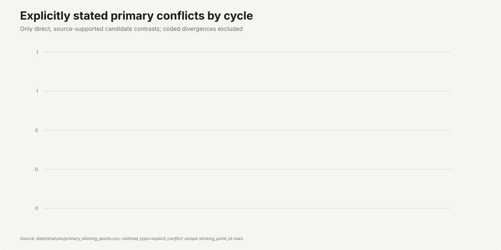

# DSA-versus-Democratic text analysis

This analysis is generated by `uv run dsa-analysis analyze-text` from the completed,
strictly validated census.

## Corpus

- Candidate/election documents: 997
- Deduplicated verified candidate excerpts: 3438
- Reviewed official DSA/DNC excerpts: 12
- Unique source-supported primary contrasts: 1251

Identical candidate quotations repeated through multiple chapter or National endorsement queues
are counted once per candidate and election.

## Source data and lineage

- `data/analysis/candidate_text_corpus.csv` is the committed row-level input. Every verified row
  contains an exact candidate quotation and source URL.
- `data/analysis/primary_sticking_points.csv` is the committed deduplicated contrast input.
- The candidate corpus is exported by code from
  `data/processed/candidate_statement_evidence.csv`, which is generated by
  `dsa-analysis merge-statement-reviews`.
- The public charts use exact words, source types, evidence statuses, election dates, and
  explicitly named conflicts. They do not use analyst-created topic totals.

## Methods

- **TF-IDF:** mean unigram TF-IDF by candidate group.
- **MPIF:** weighted log-odds z-scores with an informative Dirichlet prior, using unigrams and
  adjacent bigrams. Positive values favor DSA-endorsed candidates or DSA; negative values favor
  Democratic opponents or the DNC.
- **Document prevalence:** difference in the share of candidate/election documents containing a
  normalized feature. This prevents a few candidates who repeat a phrase many times from
  dominating the result.
- **Source mix:** direct counts of the retained `source_type` metadata attached to exact quotes.
- **Evidence volume:** direct counts of deduplicated verified quotations by election year.
- **Explicit conflicts:** unique rows marked `explicit_conflict`; analyst-coded divergences are
  excluded from the public conflict chart.

## Main language differences

- DSA-endorsed candidate features: Human Right, Tenant, Rent Control, Single Payer, Social Housing, Eviction, Guarantee, Living Wage, Medicare For All, Rent.
- Democratic opponent features: Business, Small Business, Opportunity, Children, Citizen, Trump, Bike, Training, Market, Border.
- Official DSA features: Democratic, Defunding, Defunding Police, Party, Police Refunding, Refunding, Society, Abolition.
- Official Democratic platform features: Able, Affordable, American, Capitalism, Public Option, Abide, Abide Value, Able Access.

The candidate comparison especially distinguishes rights-based housing and labor language
(`rent`, `human right`, `rent control`, `social housing`, `living wage`) from opponent language
that more often emphasizes business, opportunity, public-option mechanisms, technology,
training, and border administration.

## Document-prevalence robustness check

- More common across DSA-endorsed candidate documents:
  Human Right, Worker, Rent Control, Healthcare, Tenant, Single Payer, Social Housing, Medicare For All.
- More common across opponent documents:
  Business, American, Small Business, Opportunity, Public Option, Children, Technology, Seattle.

When MPIF and document prevalence point in the same direction, the result is less likely to be
driven by one unusually repetitive campaign.

## First-party source mix

The largest differences in the kinds of real sources recovered are:

- **Official Voter Guide:** -9.2%
- **Candidate Questionnaire:** -5.9%
- **Candidate Interview:** +5.2%
- **Campaign Website:** +3.4%
- **Campaign Page:** +3.4%
- **Campaign Issue Page:** +3.1%
- **Debate Transcript:** -2.8%
- **Campaign Release:** -1.8%

Positive values indicate a larger share of DSA-endorsed excerpts; negative values indicate a
larger share of opponent excerpts.

## Evidence volume by election cycle

- **2020:** 224 endorsed-candidate and 626 opponent quotations
- **2026:** 169 endorsed-candidate and 330 opponent quotations
- **2018:** 108 endorsed-candidate and 270 opponent quotations
- **2022:** 129 endorsed-candidate and 188 opponent quotations
- **2023:** 86 endorsed-candidate and 213 opponent quotations

These are direct counts of exact quotations, not estimates of issue importance.

## Explicitly stated conflicts

- **2020:** 202 explicit conflicts
- **2023:** 78 explicit conflicts
- **2019:** 57 explicit conflicts
- **2026:** 43 explicit conflicts
- **2025:** 38 explicit conflicts

This chart excludes analyst-coded divergences and retains only direct, source-supported conflict
records.

## Evidence coverage

- **Endorsed:** 283 verified candidate/election documents, 201 documented source gaps (58.5% verified).
- **Opponent:** 712 verified candidate/election documents, 821 documented source gaps (46.4% verified).

## Limitations

The official DSA-versus-DNC MPIF corpus is intentionally restricted to manually reviewed exact
excerpts, so it is much smaller than the candidate corpus. `source_unavailable` findings remain
unknowns rather than evidence of no position. Lexical distinctiveness measures language, not
ideology, sincerity, policy feasibility, or causal importance in election outcomes. Phrase
normalization reduces superficial variants, but it can also combine uses that differ in context;
the exact source quotations and URLs in `data/analysis/candidate_text_corpus.csv` remain the
authoritative evidence.
