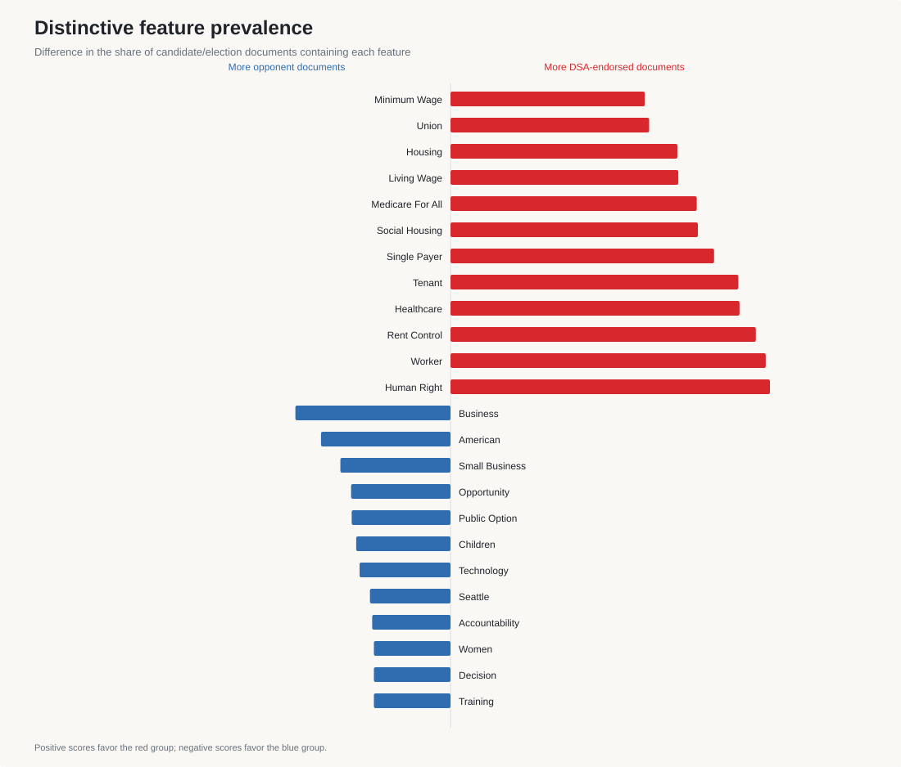
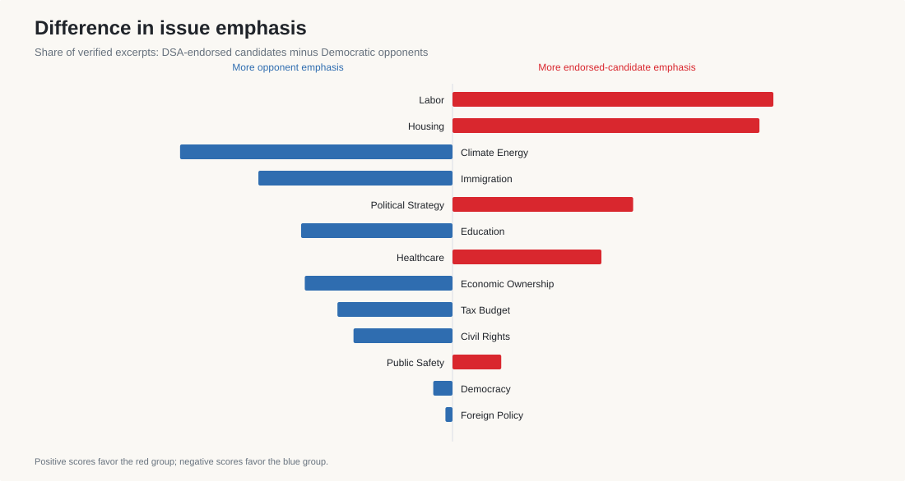
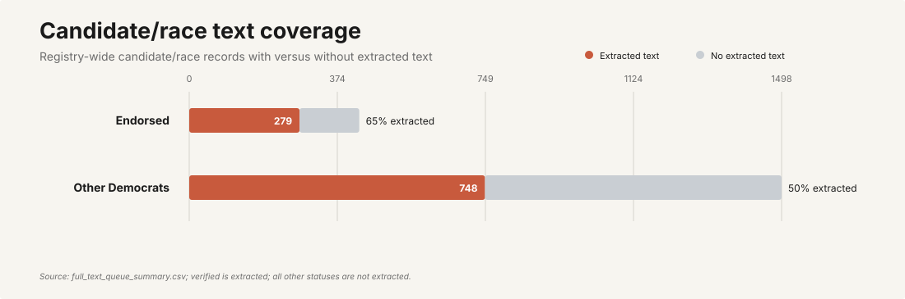

# DSA-versus-Democratic text analysis

This analysis is generated by `uv run dsa-analysis analyze-text` from the completed,
strictly validated census.

## Corpus

- Candidate/election documents: 997
- Deduplicated verified candidate excerpts: 3438
- Reviewed official DSA/DNC excerpts: 12
- Unique source-supported primary contrasts: 1251

Identical candidate quotations repeated through multiple chapter or National endorsement queues
are counted once per candidate and election.

## Methods

- **TF-IDF:** mean unigram TF-IDF by candidate group.
- **MPIF:** weighted log-odds z-scores with an informative Dirichlet prior, using unigrams and
  adjacent bigrams. Positive values favor DSA-endorsed candidates or DSA; negative values favor
  Democratic opponents or the DNC.
- **Document prevalence:** difference in the share of candidate/election documents containing a
  normalized feature. This prevents a few candidates who repeat a phrase many times from
  dominating the result.
- **Cosine similarity:** term-frequency similarity between endorsed-candidate and opponent
  language within each coded topic.
- **Sticking-point counts:** unique contrast IDs, separated into direct explicit conflicts and
  analyst-coded policy divergences.

## Main language differences

- DSA-endorsed candidate features: Human Right, Tenant, Rent Control, Single Payer, Social Housing, Eviction, Guarantee, Living Wage, Medicare For All, Rent.
- Democratic opponent features: Business, Small Business, Opportunity, Children, Trump, Citizen, Bike, Training, Market, Border.
- Official DSA features: Democratic, Society, Party, Defunding, Refunding, Defunding Police, Police Refunding, Replace.
- Official Democratic platform features: American, Able, Public Option, Affordable, Capitalism, Access, Coverage, Opt.

The candidate comparison especially distinguishes rights-based housing and labor language
(`rent`, `human right`, `rent control`, `social housing`, `living wage`) from opponent language
that more often emphasizes business, opportunity, public-option mechanisms, technology,
training, and border administration.

## Document-prevalence robustness check

- More common across DSA-endorsed candidate documents:
  Human Right, Worker, Rent Control, Healthcare, Tenant, Single Payer, Social Housing, Medicare For All.
- More common across opponent documents:
  Business, American, Small Business, Opportunity, Public Option, Children, Technology, Seattle.

When MPIF and document prevalence point in the same direction, the result is less likely to be
driven by one unusually repetitive campaign.

## Issue emphasis

The largest group differences in excerpt share are:

- **Labor:** +3.7%
- **Housing:** +3.6%
- **Climate Energy:** -3.2%
- **Immigration:** -2.3%
- **Political Strategy:** +2.1%
- **Education:** -1.8%
- **Healthcare:** +1.7%

Positive values indicate more emphasis among DSA-endorsed candidates.

## Topics with the least shared language

- **Economic Ownership:** 0.28
- **Foreign Policy:** 0.31
- **Democracy:** 0.53
- **Civil Rights:** 0.54
- **Immigration:** 0.62

Low similarity identifies different vocabulary within an issue; it does not by itself prove
opposing policy positions.

## Cycles with the most recorded contrasts

- **2020:** 453
- **2023:** 138
- **2019:** 130
- **2026:** 125
- **2018:** 109

Counts depend on recoverable first-party material and the number of identified primaries in each
cycle. They are not measures of voter salience.

## Evidence coverage

- **Endorsed:** 283 verified candidate/election documents, 201 documented source gaps (58.5% verified).
- **Opponent:** 712 verified candidate/election documents, 821 documented source gaps (46.4% verified).

## Limitations

The official DSA-versus-DNC MPIF corpus is intentionally restricted to manually reviewed exact
excerpts, so it is much smaller than the candidate corpus. `source_unavailable` findings remain
unknowns rather than evidence of no position. Lexical distinctiveness measures language, not
ideology, sincerity, policy feasibility, or causal importance in election outcomes. Phrase
normalization reduces superficial variants, but it can also combine uses that differ in context;
the exact source quotations remain the authoritative evidence.
